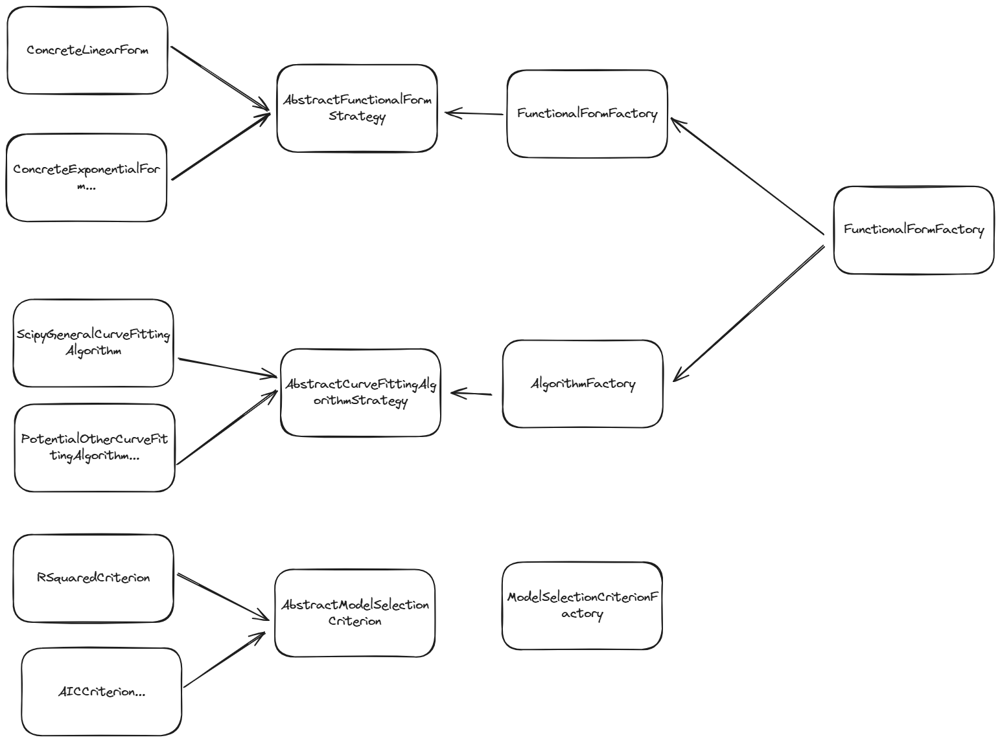
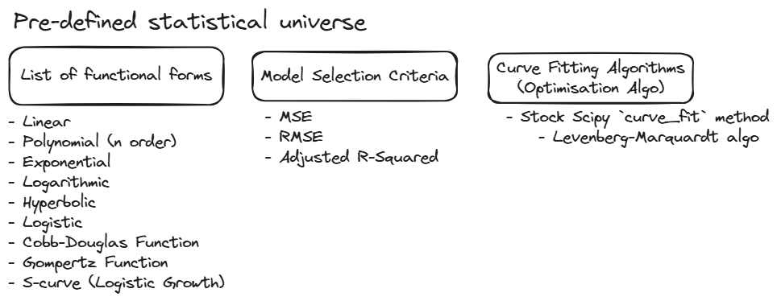

# FitMaster

FitMaster is a versatile and efficient tool for robust curve fitting with advanced validation and model selection features. It supports multiple functional forms, fitting algorithms, and model selection criteria, making it a powerful solution for a wide range of curve fitting tasks.

## Features

- **Multiple Functional Forms**: Supports linear, exponential, logarithmic, and more.
- **Comprehensive Model Selection**: Includes metrics such as AIC, BIC, and R-squared.
- **Extensible and Modular**: Easily add new functional forms, algorithms, and selection criteria.

## Architecture

FitMaster's high-level design is illustrated in the following diagram:

## Conceptual Framework

The following diagram provides a conceptual overview of the statistical universe that FitMaster operates within:

## Example

Example usage of FitMaster can be found in [the `example.py` file](example.py)

## Installation

Use the package manager poetry to install FitMaster.
