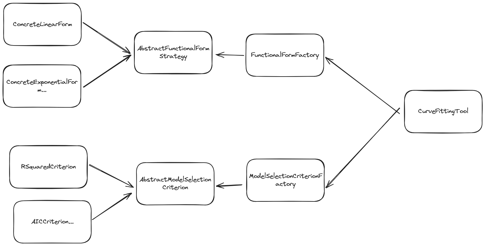
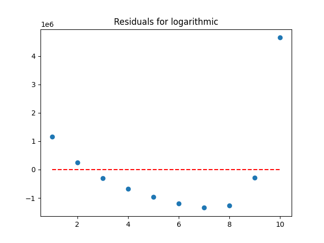

# FitMaster

FitMaster is a versatile and efficient tool for robust curve fitting with advanced validation and model selection features. It supports multiple functional forms, fitting algorithms, and model selection criteria, making it a powerful solution for a wide range of curve fitting tasks.

## Features

- **Multiple Functional Forms**: Supports linear, exponential, logarithmic, and more.
- **Comprehensive Model Selection**: Includes metrics such as AIC, BIC, and R-squared.
- **Extensible and Modular**: Easily add new functional forms, algorithms, and selection criteria.

## Architecture

FitMaster's high-level design is illustrated in the following diagram:



## Conceptual Framework

The following diagram provides a conceptual overview of the statistical universe that FitMaster operates within:


## Example

Example usage of FitMaster can be found in [the `example.py` file](example.py)

```python
import numpy as np
from fitmaster.core.curve_fitting_tool import CurveFittingTool, CurveFittingVisualizer
import matplotlib.pyplot as plt

# Generate example univariate data
x_data = np.linspace(1, 10, 10)
y_data = 2 * np.exp(1.5 * x_data) + 5 + np.random.normal(0, 5, len(x_data))

# Create the curve fitting tool
tool = CurveFittingTool()
visuals = CurveFittingVisualizer()

# Fit and evaluate models
results = tool.search_and_evaluate(x_data, y_data)

# Print results
for result in results:
    print(result)

# Plot the results
fig, ax = visuals.plot_fits(x_data, y_data, results)
plt.show()

# Plot residuals
figs_axes = visuals.plot_residuals(x_data, y_data, results)
for fig, ax in figs_axes:
    plt.show()
```

## Example Charts





## Installation

Use the package manager poetry to install FitMaster.
